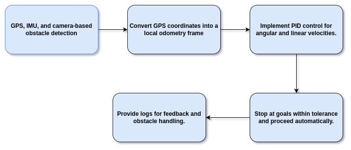
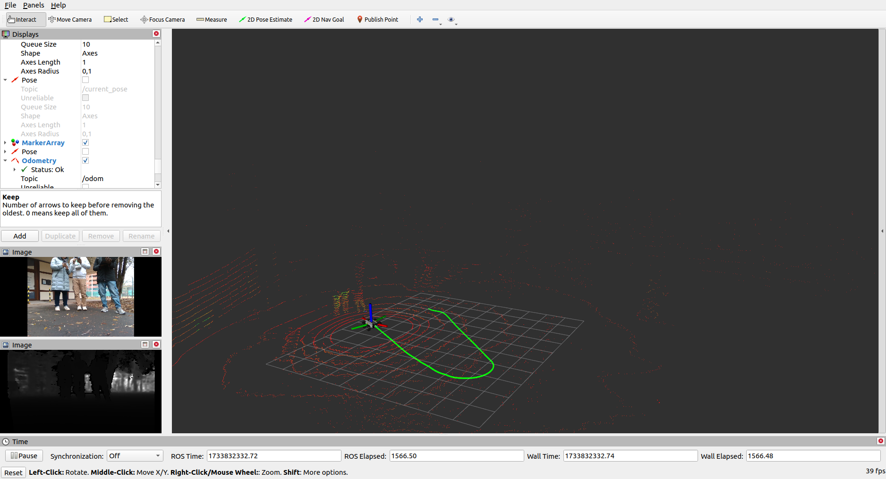
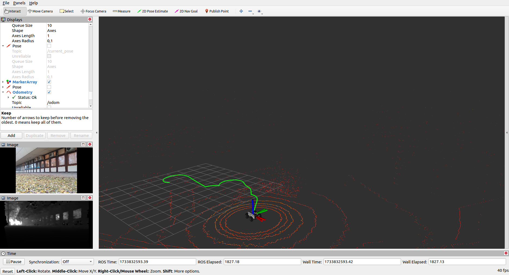
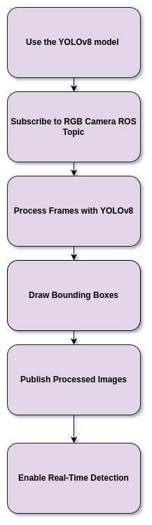
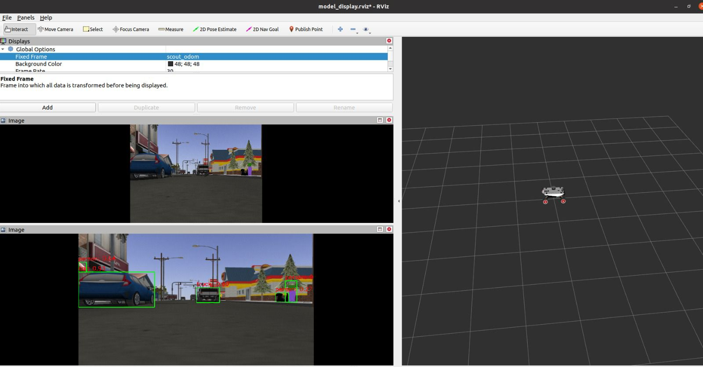
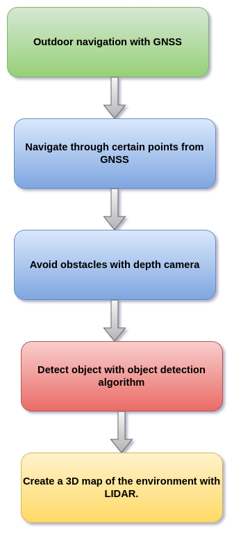
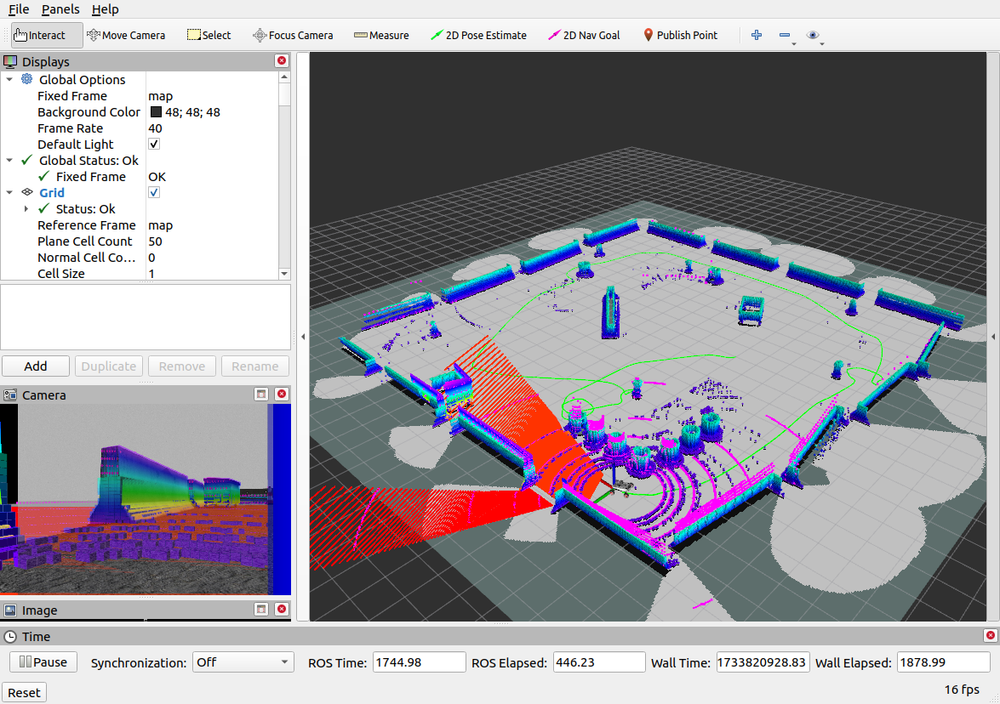

# 📋 ELTE IFROS PROJECT

   
## Outdoor Navigation and Object Detection with Scout-Mini Robot

### 👥 Group Members 

   1. 👤 Goitom A. Leaku  
   2. 👤 Afsha Syma  
   3. 👤 Sazid Mir Mohibullah
   
## 📚 Table of Contents

1. [📖 Introduction](#introduction)
2. [🔧 Installation](#installation)
3. [🚀 Usage](#usage)
4. [🛠️ Implementation](#features)
5. [🔧 Future Work](#future-work)
6. [📺 Video Link](#youtube-video-link)

## Introduction

This project focuses on outdoor navigation and object detection with obstacle avoidance on Scout-Mini differential drive robots in unknown environments. GPS predefined goals are provided for the robot to navigate while avoiding obstacles and detecting objects in the outdoor environment.
<!-- Images with custom dimensions -->


## Installation

To run this package, the following dependencies should be installed:

   🔰 ROS (Robot Operating System)
   
   🌐 UTM GPS package.
   
   🔦 Ultralytics
   
## Usage

To use this package, clone it to your catkin workspace:
```sh
cd your_workspace/src
git clone git@github.com:IFRoS-ELTE/Outdoor-Nav-and-Object-Detection.git
cd ..
catkin build
```
N.B: before using this package make sure the minimal things are launched.

```bash
   - sudo ip link set can0 up type can bitrate 500000
   - roslaunch scout_bringup scout_minimal.launch
   - roslaunch xsens_mti_driver xsens_mti_node.launch
```
In addition as the TF of the camera is not well calibrated, what was working for us:
```bash
   - rosrun tf static_transform_publisher 0.07 0 0.130 0 0 0 base_link camera_link 100
   - roslaunch realsense2_camera rs_camera.launch
```
To test simple depth camera based obstacle avoidance in the robot: NOTE: For proper name this repo name is changedand can be rename after it is cloned[package_name is 'scout_mini_project']

```bash
- rosrun scout_mini_project camera_nav_test_robot.py
```

For GPS based Navigation
```bash
- rosrun scout_mini_project nav_gps_robot.py
```
For Object detection, before running directly using noetic default, make sure to create virtual env(python 3.10) as YOLO-V8 is used.

Inside your env:install some ros pkgs:

```bash
- rosrun scout_mini_project yolov8_node.py

```

## 🤖 Implementation

The main tasks of this project are outlined below:

### GPS Waypoint Navigation

The robot is given predefined GPS waypoints to navigate towards. The GPS data is converted into local coordinates for more accurate navigation, enabling the robot to move to specific goals in the environment.



*SOME EXPERIMENT RESULTS::*






<p align="center">
  <a href="https://www.youtube.com/embed/ERzAHPfvgZg" target="_blank" style="font-size: 20px;">You can watch the real robot navigation for the second above image </a>
</p>

### Depth Camera-Based Obstacle Avoidance

The depth camera provides depth data that is used to detect obstacles in the robot's path. This information is used for real-time obstacle avoidance, ensuring the robot can navigate around obstacles while heading towards the goals.
<!--  -->

### Object Detection

A YOLO-based object detection system is implemented to identify objects in the robot's surroundings. This is useful for tasks such as identifying specific objects that the robot might need to interact with or avoid.
<p align="center">
  
</p>




## Full Process
Here this is our whole process for our outnavigation and object detection. Because of the time limitation, we could not test the object detection and 3D map creation in real robot
<p align="center" style="margin-top: -20px;">
  
</p>

# EXTRA: For fun we created the 3D map of the simulation env.




## Future Work
- **Integrating Object Detection with GPS Waypoint Navigation**: The future goal is to combine object detection with GPS navigation.
  
- **Fusing GPS Waypoint Navigation with SLAM**: In the future, integrating SLAM (Simultaneous Localization and Mapping) with GPS waypoint navigation can create more accurate localization and mapping in the environment, improving the robot's ability to navigate and interact with dynamic surroundings.

## 📺 Video Link

[Navigation-Obstacle Avoid](https://www.youtube.com/watch?v=k4bYRUCNpq0&ab_channel=MirMohibullahsazid)

[Object Detection](https://www.youtube.com/watch?v=SrmWNpqsRHo&t=1s&ab_channel=MirMohibullahsazid)

[MultiPoint Navigation with GNSS](https://youtu.be/0Ty81WIx-vM) 

# Thanks!!
